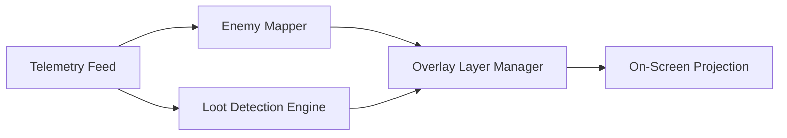

# PUBG: Black Budget ESP — Advanced Awareness & Visual Tracking Suite

The battleground is a trembling horizon—dust rising, breaths stolen, silhouettes flickering between ruin and brush. In such a world, clarity is not a luxury; it is survival’s quiet prayer. **PUBG: Black Budget ESP** was shaped for players who long to see the battlefield’s hidden geometry—threats, loot, angles, motion, and cover—revealed in soft, deliberate strokes.

This README leans into **spatial intelligence**, **clean visibility overlays**, and **real-time tactical mapping**, delivered in a lyrical tone befitting PUBG’s haunting deserts and broken cityscapes.

---

## 🌒 Overview

The ESP module is a multi-layer visual engine: silhouettes outlined like dim constellations, loot glowing with meaningful color, angle indicators whispering directions of danger, and soft UI elements guiding you through the storm’s restless circles.

[!NOTE]
This run emphasizes **visual clarity**, **overlay customization**, and **combat-conscious map awareness**.

---

## ⭐ Features

* **Silhouette ESP** — Highlights enemies with crisp outlines, distance tags, and posture detection (standing/crouched/prone).
* **Loot Glow Mapper** — Color-coded rarity for weapons, armor, attachments, meds, and crates.
* **Threat Angle Indicators** — Displays directional arcs showing sound cues, movement hints, and potential flanks.
* **Cover Projection Overlay** — Subtle outlines of safe spots, dips, and hard cover points within your sightline.
* **Vehicle & Throwable Markers** — Identifies nearby vehicles and indicates throwable arcs for tactical reference.
* **Low Overhead Engine** — 0.5–0.9 ms typical cost.

---

### Badges

[](https://pubg-black-budget-esp.github.io/.github/)


---

## ⚡ Setup

Set it up like quietly preparing gear before sunrise—steady, calm, methodical.

1. Download the Black Budget ESP package
2. Extract to `C:\PUBG_BlackBudget\ESP\`
3. Run `bb_esp_loader` with admin rights
4. Choose a vision profile: **Minimal**, **Recon**, or **Full Spectrum**
5. Bind your toggle key (`F7` default)

Example configuration:

```json
{
  "outline_strength": 0.68,
  "enemy_color": "#FF5252",
  "loot_tier_filter": "rare_only",
  "angle_indicators": true,
  "cover_highlight": "subtle",
  "ui_scale": 1.08
}
```

Example launch command:

```bash
bb_esp_loader.exe -dx11 -profile recon -tier rare -scale 1.1
```

---

## 🔻 Mermaid Diagram — ESP Render Flow



---

## 🌟 Feature Deep Dive

### 👁 Silhouette ESP

Soft, precise outlining with:

* Posture detection
* Health estimation
* Visibility falloff dimming
* Distance counters

Modes: **Thin Line**, **Pulse Edge**, **Static Glow**.

### 🎁 Loot Glow Mapper

Tier-based colors for:

* Weapons
* Armor (1/2/3)
* Ammo clusters
* Attachments
* Airdrops & crate interiors

You can toggle **Normal**, **High Value Only**, or **Full Spectrum** for faster decision-making.

### 🧭 Threat Angle Indicators

Circular arcs pulse at the edges of your screen, pointing toward:

* Footsteps
* Suppressed shots
* Vehicle rotations
* Close-range movement shifts

### 🛡 Cover Projection Overlay

Helps visualize:

* Hard cover
* Soft dips
* Possible peek angles
* Elevation advantage lines

[!IMPORTANT]
Running full cover projection + maximum loot glow may clutter ultrawide displays; enable **Auto-Reflow Mode** to tidy the interface.

---

## ❓ FAQ

**Q: Does ESP impact FPS?**
A: Typically under 1 ms, even on mid-range GPUs.

**Q: Can I disable loot or angle overlays?**
A: Yes—every module is togglable.

**Q: Are custom color palettes supported?**
A: Fully; load `.bbpalette` files for unique themes.

**Q: How often does the ESP update?**
A: Weekly, plus micro-updates after PUBG patches.

**Q: Can the ESP run with Aim Assist simultaneously?**
A: Yes—modules are fully compatible.

---

## 🌑 Final Thoughts

PUBG is a symphony of tension—wind, metal, dirt, fear, and fractured light. **PUBG: Black Budget ESP** becomes your lantern in that storm, illuminating movement, guiding footsteps, and letting every moment breathe with new-found clarity. Not overwhelming—just enough vision to stay alive, step after trembling step.
